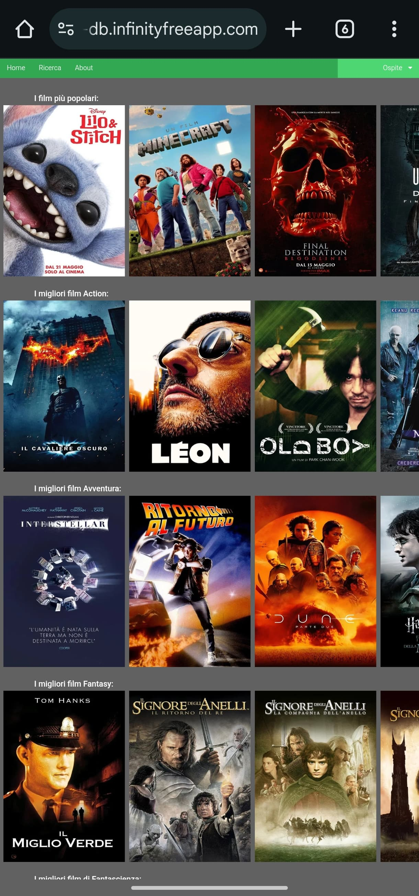

# PHP Movie Database
Welcome to **PHP Movie Database**, a simple web application built with PHP, MySQL, HTML, CSS, and JavaScript.  
This project allows users to browse and search for movies in a clean, responsive interface.

## Table of Contents
- [Live Demo](#live-demo)
- [Features](#features)
- [Technologies Used](#technologies-used)
- [Features and methods used](#features-and-methods-used)
- [Screenshots](#screenshots)

## Live Demo
You can visit the live version of the site here:  
[http://tomasoni-movie-db.infinityfreeapp.com](http://tomasoni-movie-db.infinityfreeapp.com)

## Features
- Browse movies with details such as title, genre, year, and description
- Discover new and most popular movies
- Search functionality to find movies by title or genre  
- Responsive layout for desktop and mobile devices  
- Backend powered by PHP and MySQL database  
- Simple and clean UI using HTML, CSS, and JavaScript
- Responsive layout for desktop and mobile devices
- User registration and login functionality
- Save favorite movies to personal account

## Technologies Used
- PHP (server-side scripting)  
- MySQL (database management)  
- HTML5 & CSS3 (structure and styling)  
- JavaScript (frontend interactivity)

## Features and methods used
- CSS styling
- Custom navigation and scroll bar
- POST methods
- Search by Keyword
- Youtube player integration
- Form-based login system
- Session management
- Responsive layout with CSS / JS 
- MySQL Relational Database Structure
- PDO connection
- Dynamic pages
- Password hashing
- External API call
- Data extraction from JSON files

## Screenshots

